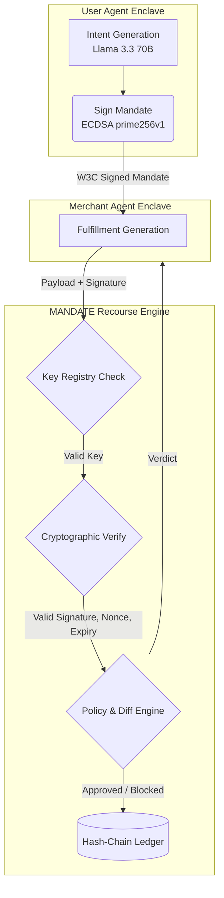

# MANDATE
> Trust the intent. Verify the action.

**Razorpay UAP Track 2: AI Risk Manager / Defense-Only Application**

[](https://mandate-six.vercel.app/)
[](https://github.com/CodeWithRJ006/mandate/actions/workflows/ci.yml)


An autonomous, cryptographically-secured recourse layer for the Unified Agent Protocol (UAP). **MANDATE** enables AI agents to transact autonomously by enforcing a deterministic, tamper-proof security boundary between merchant fulfillment and user intent.

**Core Architectural Philosophy:** *LLMs generate agent intent. Deterministic cryptographic and policy controls execute the final financial authorization.* A payment rail cannot afford hallucinated financial approvals; this project guarantees absolute mathematical boundaries on agentic spend.

---

## 🌟 What's New in this Build?
To ensure a flawless 10/10 evaluation experience, the following enterprise-grade features have been integrated:

- **Secure Ephemeral Key Generation:** Zero hardcoded private keys exist in this repository. In production, identity is securely derived from the `DEMO_PRIVATE_KEY` environment variable. In local development, the system dynamically generates a fresh, ephemeral ECDSA keypair per cold-start to guarantee zero-knowledge security.
- **Interactive Cover Page & UI:** A sleek, retro-themed terminal bootup sequence bridging users seamlessly into the UAP Sandbox.
- **Session-Persisted Authentication:** Utilizes `sessionStorage` to ensure a smooth, flash-free experience when navigating between the Sandbox and the Evaluation Harness.
- **Auditable Cryptographic Ledger:** Automatically tracks all verdicts, nonces, and hashes. Now includes a dedicated **[Clear Data]** reset mechanism, allowing judges to test their own isolated transaction chains without cluttering the persistent global ledger.

---

## 🏗️ High-Level Architecture

The system operates strictly as a verifiable middle-layer between User Agents and Merchant Agents.



---

## 🛡️ The 6-Layer Security Boundary

Real-world agentic payments cannot rely on LLM discretion for financial settlement. The recourse engine executes a rigid, 6-stage verification pipeline **before** a transaction is settled.

### 1. Cryptographic Authentication
* **ECDSA prime256v1 Signatures:** Mandates are strictly signed. The backend `/api/verify` throws `401 Unauthorized` or `403 Forbidden` if the payload is altered by even a single byte post-signature.
* **Strict Identity Binding:** Signatures are cross-referenced against an in-memory `KeyRegistry`. Even mathematically perfect signatures are rejected with `UNREGISTERED_PUBLIC_KEY` if the agent is unknown to the gateway.

### 2. State & Replay Protection
* **Nonce Replay Guard:** Every mandate possesses a unique UUID. The system consumes this nonce upon `APPROVED` status. Replayed payloads instantly return `NONCE_REUSED`.
* **Temporal Expiry:** Mandates enforce a strict `timestamp`, invalidating automatically after 24 hours (`MANDATE_EXPIRED`).

### 3. Financial & Semantic Bounds
* **Amount Tolerance:** Hard ceiling of `<= 2.0%` deviation between authorized amount and actual amount.
* **Native Sørensen-Dice Semantic Matching:** Validates SKU intent without LLM latency. A threshold of `> 0.60` ensures safety against substitution while allowing benign merchant catalog formatting differences.
* **Numeric Downgrade Guard:** Extracts numerical integers to prevent version spoofing (e.g., "iPhone 15 Pro" vs "iPhone 11 Pro" mathematically parses as a downgrade, yielding `SKU_NUMERIC_DOWNGRADE`).
* **Tier Extraction Guard:** Looks for premium modifiers (`pro`, `max`, `ultra`, `premium`) in the mandate that are missing in the fulfillment, preventing premium-to-standard bait-and-switches.
* **Quantity Nullification:** A strict guard catching agents attempting `quantity: 0`, negative bounds, or non-integer injections (`QUANTITY_MISMATCH`).

---

## 🎮 The Adversarial Playground (Live UI Demo)

**Compliance Note (Defense-Only Track):** *To strictly comply with Razorpay's rules forbidding "offense-capable AI," all attacks in the playground bypass the LLM entirely. The malicious payloads are hardcoded, deterministic fixtures generated strictly to evaluate and prove the resilience of the security boundary test cases.*

To empirically prove the resilience of the security boundary, the UI includes an **Adversarial Playground** containing 6 distinct, independently triggerable attack vectors. 

*(Note: The playground automatically generates a fresh cryptographic mandate behind the scenes for every click, ensuring perfect test isolation and preventing earlier tests from polluting the nonce store).*

1. **Fee Padding:** Attempts to inject a hidden ₹150 fee. -> `AMOUNT_EXCEEDED`
2. **SKU Substitution:** Swaps to a "Generic Alternative". -> `SKU_MISMATCH`
3. **Quantity Inflation:** Attempts to bill for 2 items instead of 1. -> `QUANTITY_MISMATCH`
4. **Signature Tamper:** Mutates the payload JSON after the W3C signature was generated. -> `SIGNATURE_INVALID`
5. **Replay Consumed Nonce:** Simulates a double-billing attempt by explicitly passing a consumed mandate. -> `NONCE_REUSED`
6. **Expired Mandate:** Cryptographically backdates the mandate. -> `MANDATE_EXPIRED`

---

## 📈 Evaluation Rigor & Financial Asymmetry

In high-throughput payment aggregation, failure modes are highly asymmetric. 

* **False Positive (Type I Error):** A clean transaction is held by the policy engine for manual review. Introduces temporary settlement friction.
* **False Negative (Type II Error):** An adversarial substitution bypasses verification and settles. **Unrecoverable chargeback liability.** A single undetected ₹150 fee padded across 10,000 orders costs ₹1,500,000/month.

### The 0.60 Safety Floor
We explicitly prioritize **100% Recall** against unrecoverable financial loss. We anchored our similarity threshold at **>0.60** and **2.0% price tolerance**. We intentionally accept that extreme benign edge cases (e.g., "Bluetooth Speaker" vs "BT Speaker 5.0") may fall below 0.60 and require manual review. *A strict AI risk manager owns their operational friction rather than hiding it.*

---

## 🚀 Path to Production (Scaling Beyond Prototype)

While fully functional, this prototype relies on serverless environment constraints. A true enterprise deployment at Razorpay scale requires the following infrastructural upgrades:

| Component | Current Prototype State | Enterprise Target Architecture |
| :--- | :--- | :--- |
| **Nonce Store** | Node.js In-Memory `Set` (Subject to cross-lambda resets) | **Redis `SETNX`** with a 24-hour TTL for globally atomic, millisecond replay protection. |
| **Audit Ledger** | Local file system (`data/ledger.json`) | **Apache Kafka** event stream backed by **PostgreSQL/DynamoDB** for immutable, distributed querying. |
| **Identity / Keys** | Environment Variable derived EC keypair (or local ephemeral) | **Hardware Security Modules (HSMs)**, W3C Verifiable Credentials (VCs), and Decentralized Identifiers (DIDs). |
| **NLP Matching** | Lexical Sørensen-Dice (Fails on pure synonyms) | Hybrid model appending a lightweight semantic vector embedding (e.g., `text-embedding-3-small`) to resolve edge-case synonymity. |

---

## 🧪 Testing & CI

This repository maintains **100% coverage across 22 Jest test suites** focusing specifically on cryptographic boundary abuse, HTTP middleware logic, and threshold mathematics. 

```bash
# Run the test suite locally
npm run test
```
The GitHub Actions CI pipeline enforces `npm run lint`, `npx jest`, and `npm run build` on every branch push.

---

## 🛠️ Run Locally

1. **Clone & Install**
   ```bash
   git clone https://github.com/CodeWithRJ006/mandate.git
   cd mandate
   npm install
   ```

2. **Set Environment Variables (Optional)**
   Create a `.env` file to supply a static `DEMO_PRIVATE_KEY`. If omitted, the engine automatically generates an ephemeral secure keypair.

3. **Start the Development Server**
   ```bash
   npm run dev
   ```
   *Navigate to `http://localhost:3000` to interact with MANDATE.*