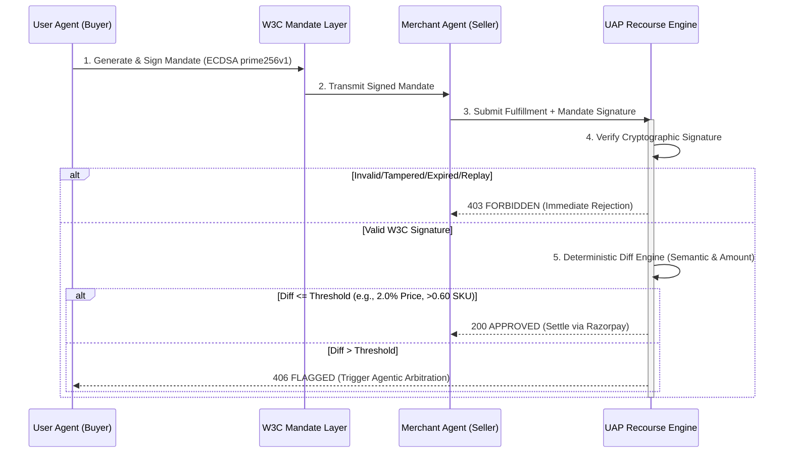

# Razorpay UAP - Agentic Recourse Layer
**Track 2: AI Risk Manager / Defense-Only Application**

An autonomous, cryptographically-secured recourse layer for the Unified Agent Protocol (UAP). This system enables AI agents to transact autonomously by enforcing a deterministic, tamper-proof security boundary between merchant fulfillment and user mandates.

---

## 🔒 The Strict Security Boundary (Core Innovation)

Real-world agentic payments cannot rely on LLM discretion for financial settlement. This project introduces a mathematically rigid security boundary that executes **before** any AI evaluation occurs. 

1. **ECDSA prime256v1 Signatures:** The W3C-inspired mandate is signed in the client. The backend `/api/verify` throws a strict `401 Unauthorized` (unsigned) or `403 Forbidden` (tampered) if the signature is invalid.
2. **Quantity Nullification Guard:** A strict nullish-coalescing guard catches edge cases where a malicious agent attempts a `quantity: 0` attack to bypass amount validations.
3. **Nonce Replay Prevention:** Every mandate generates a unique cryptographic nonce. The ledger strictly rejects duplicated nonces to prevent double-billing.
4. **24-Hour Expiry Window:** Mandates enforce a strict `timestamp`, invalidating automatically after 24 hours.

### The Resolution State Machine


---

## 🛡️ The Adversarial Playground (Live UI Demo)

To empirically prove the resilience of the security boundary, the UI includes an **Adversarial Playground** containing 6 distinct, independently triggerable attack vectors. 

Once a valid mandate is generated, a reviewer can click any of these attacks to watch the system catch and reject the fraud in real-time, displaying the exact rejection code:

1. **Fee Padding:** Attempts to inject a 15% hidden fee. -> `AMOUNT_EXCEEDED`
2. **SKU Substitution:** Attempts a bait-and-switch (e.g., "BT Speaker" -> "Radio"). -> `SKU_MISMATCH`
3. **Quantity Inflation:** Attempts to bill for 5 items instead of 1. -> `QUANTITY_MISMATCH`
4. **Signature Tamper:** Mutates the payload JSON after the W3C signature was generated. -> `SIGNATURE_INVALID`
5. **Nonce Replay:** Attempts to submit a previously settled mandate nonce. -> `NONCE_REUSED`
6. **Expired Mandate:** Cryptographically backdates the mandate by 10,000ms. -> `MANDATE_EXPIRED`

---

## 📊 Evaluation Rigor & Financial Asymmetry

In high-throughput payment aggregation, failure modes are asymmetric. This system was rigorously tuned offline across a 45-case, 8-category stratified dataset to find the exact mathematical safety floor.

* **False Positive (Type I Error):** A clean transaction is held by the policy engine for manual review. Assuming an average ticket size of INR 11,800, every 1% FPR introduces temporary settlement friction and a customer support arbitration cost of ~INR 120 per ticket. *(Note: Modeled assumptions).*
* **False Negative (Type II Error):** An adversarial substitution bypasses verification and settles. This is unrecoverable chargeback liability. A single undetected INR 150 fee padded across 10,000 orders costs INR 15,00,000/month.

### The 0.60 Safety Floor
We explicitly prioritize **100% Recall** against unrecoverable financial loss. Adversarial product substitutions—such as the "iPhone 15 Pro" vs "iPhone 13 Mini" attack present in our 30% Held-Out set—score exactly `0.571` on the Sørensen-Dice coefficient.

If we pushed the threshold to `0.55` to reduce friction, Recall would abruptly crash as the iPhone substitution slips through. Therefore, we anchored our live baseline at **>0.60 similarity** and **2.0% price tolerance**.

**The Tradeoff:** This drives the tuning False Positive Rate to 15.4%. This 15.4% consists entirely of genuine semantic variants (e.g., "Bluetooth Speaker" vs "BT Speaker", which scores 0.461). We intentionally accept that these benign abbreviations require manual review to completely eliminate Type II substitution attacks. *A strict AI risk manager owns their operational friction rather than hiding it.*

---

## ⛓️ Cryptographic Audit Ledger

To prove non-repudiation, the system maintains an in-memory SHA-256 hash-chain ledger (`lib/ledger.ts`). Every evaluation automatically commits a block containing the `verdict`, `nonce`, and `prevHash`. The live UI dynamically polls this chain to verify integrity. You can intentionally corrupt a block in the UI to watch the chain break. 

> [!NOTE]
> **Ephemerality (by design):** For the live Vercel demo, both the hash-chain ledger and the nonce replay guard reset on Vercel cold-starts. This is intentional for a hackathon. In a production environment, the ledger would be backed by a persistent data store (Kafka/DynamoDB) and the nonce store would use Redis with a 24-hour TTL.

---

## 🚀 Setup & Fallback Instructions

If the Vercel deployment is slow or unavailable (cold start, rate limit), the entire system can be demonstrated locally:

```bash
git clone https://github.com/CodeWithRJ006/razorpay-uap-recourse.git
cd razorpay-uap-recourse
npm install
npm run dev
```

> The mock fallback (`GROQ_API_KEY` not required) will activate automatically, keeping the full UI and all 6 adversarial demo paths 100% functional without any external API dependency.

If you have a Groq key, create a `.env.local` file:
```env
GROQ_API_KEY=your_groq_api_key_here
```

### Run the Evaluation Harness
To reproduce our 15.4% FPR tradeoff and mathematical tuning matrix directly in your terminal:
```bash
npx tsx scripts/evaluate-risk-engine.ts
```

---

## 🛠️ Live API Verification (Bring Your Own Transaction)

To verify the policy engine is a real cryptographic service, evaluate arbitrary payloads against the deterministic diff engine:

```bash
curl -X POST https://razorpay-uap-recourse.vercel.app/api/verify \
  -H "Content-Type: application/json" \
  -d '{
    "mandate": {
      "sku": "Organic Apples",
      "authorized_amount": 1000,
      "quantity": 1,
      "nonce": "readme-demo-nonce-999",
      "signature": "MEUCIQCx8Kjv+mSQb9uOrmOZgkwznQ/gjeaekJgyTu0rXfAldAIgfPUvrsf3/ncDimPZIUlqWTZP79q2BmNr8ayRKpnNxis=",
      "publicKeyPem": "-----BEGIN PUBLIC KEY-----\nMFkwEwYHKoZIzj0CAQYIKoZIzj0DAQcDQgAE2ngOmg6UfV/a80UmQ5Y/1DI4FW0G\nP7zd7ReKCorRrNkmHTS/9I347smuOWoK/sxMM6OKnMdzhnfidzx77NxA7A==\n-----END PUBLIC KEY-----\n"
    },
    "fulfillment": {
      "sku": "Organic Apples (1kg)",
      "actual_amount": 1015,
      "quantity": 1
    }
  }'
```

*(Note: If you alter the payload without updating the ECDSA signature, the API will strictly reject it with a 403).*

---
**Hackathon Compliance:** Built explicitly for Track 2 (Defensive). The "Malicious Fulfillment" generation in the UI is strictly a mock simulator designed solely to exercise the defensive verification engine. It contains no offensive AI capabilities.